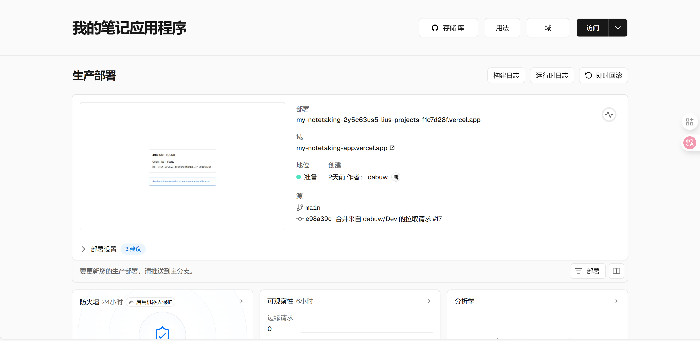

# Lab 2 Project Development Report: MyNoteTaking Intelligent Note-Taking Application

## Project Overview

This project developed a Flask-based intelligent note management application that integrates GitHub Models AI services, supporting natural language input to generate structured notes. The project was built from scratch and went through a complete development, testing, deployment, and optimization process.

**Project Name:** MyNoteTaking - Personal Note Management Application  
**Development Time:** October 2025  
**Deployment URL:** https://my-notetaking-application-25048609g.vercel.app/  
**GitHub Repository:** https://github.com/dabuw/my-notetaking-app-last  

## System Architecture

### Technology Selection Considerations
In technology selection, I mainly considered learning costs and project requirements:

- **Backend Framework:** Flask 3.1.1 - Chosen for its simplicity, ease of learning, and comprehensive documentation
- **Database:** SQLite (development) + PostgreSQL (production) - SQLite for local development convenience, PostgreSQL for online stability
- **AI Service:** GitHub Models API (GPT-4o-mini) - Sufficient free quota and simple API calls
- **Deployment Platform:** Vercel - Easy deployment
- **Frontend:** Native HTML/CSS/JavaScript - Although basic, allows complete control over code logic

### Project Structure
```
MyNoteTaking/
├── api/
│   └── index.py             # Vercel deployment entry point
├── src/
│   ├── models/           # Data models
│   ├── routes/           # API routes
│   ├── static/           # Frontend files
│   ├── call_llm_model.py    # AI model calling
│   ├── llm.py               # LLM client configuration
│   └── main.py              # Flask application entry
├── database/                # Database files
├── requirements.txt         # Dependencies list
└── vercel.json              # Deployment configuration
```

## Development Process

### Basic Framework Setup

#### Application Initialization
Initially, I created the basic Flask application structure. Configuring CORS was particularly important because frontend-backend separation requires handling cross-origin issues:

```python
# src/main.py
from flask import Flask
from flask_cors import CORS
from flask_sqlalchemy import SQLAlchemy

app = Flask(__name__, static_folder='static')
CORS(app, resources={
    r"/api/*": {
        "origins": ["*"],
        "methods": ["GET", "POST", "PUT", "DELETE", "OPTIONS"]
    }
})
```

#### Data Model Design

```python
# src/models/note.py
class Note(db.Model):
    id = db.Column(db.Integer, primary_key=True)
    title = db.Column(db.String(200), nullable=False)
    content = db.Column(db.Text, nullable=False)
    tags = db.Column(db.Text)  # JSON array
    event_date = db.Column(db.Date)
    event_time = db.Column(db.Time)
    created_at = db.Column(db.DateTime, default=datetime.utcnow)
    updated_at = db.Column(db.DateTime, default=datetime.utcnow)
```

#### API Interface Implementation
Designed basic CRUD interfaces following RESTful standards:
- `GET /api/notes` - Get all notes
- `POST /api/notes` - Create new note
- `PUT /api/notes/<id>` - Update note
- `DELETE /api/notes/<id>` - Delete note
- `GET /api/notes/search` - Search notes

### AI Feature Integration

#### Choosing GitHub Models API
For AI services, I chose GitHub Models. The main reasons were that it's student-friendly, same as used in Lab 1, and the model's performance was sufficient for my requirements.

The API call encapsulation was relatively simple:

```python
# src/llm.py
def call_llm_model(model: str, messages: List[Dict[str, Any]], temperature: float = 1.0) -> str:
    headers = {
        "Authorization": f"Bearer {GITHUB_TOKEN}",
        "Content-Type": "application/json",
    }
    
    payload = {
        "model": model,
        "messages": messages,
        "temperature": temperature,
    }
    
    resp = requests.post(ENDPOINT, headers=headers, json=payload, timeout=15)
    return resp.json()["choices"][0]["message"]["content"]
```

#### Smart Note Generation Implementation
This feature is the highlight of the entire project. Users can input natural language, such as "Meeting at 5 PM today to discuss project progress", and the system will automatically extract:
- Appropriate title
- Structured content
- Related tags
- Event time information

#### Time Parsing Challenge
During development, I encountered a particularly tricky problem: AI always made errors when parsing relative time expressions like "the day after tomorrow".

**Problem Analysis:** The system prompt used hardcoded current dates, leading to inaccurate parsing.

**Solution:** Implemented dynamic date template generation:

```python
def get_current_date_template():
    now = datetime.now()
    today = now.date()
    tomorrow = today + timedelta(days=1)
    day_after_tomorrow = today + timedelta(days=2)
    
    return f"""Current time information:
- Today: {today.strftime('%Y-%m-%d')} ({today.strftime('%A')})
- Tomorrow: {tomorrow.strftime('%Y-%m-%d')} ({tomorrow.strftime('%A')}) 
- Day after tomorrow: {day_after_tomorrow.strftime('%Y-%m-%d')} ({day_after_tomorrow.strftime('%A')})
- Current time: {now.strftime('%Y-%m-%d %H:%M')}"""
```

### Frontend Interface Development

#### Responsive Design
Implemented beautiful user interface using modern CSS technologies:
- CSS Grid and Flexbox layout
- Glass Morphism effects
- Gradient backgrounds and smooth animations
- Mobile device adaptation

#### Interactive Feature Implementation
- Real-time search functionality
- Auto-save mechanism
- Note preview
- AI-generated note integration

```javascript
// Real-time search implementation
function performSearch() {
    const query = document.getElementById('search').value;
    const filteredNotes = notes.filter(note => 
        note.title.toLowerCase().includes(query.toLowerCase()) ||
        note.content.toLowerCase().includes(query.toLowerCase())
    );
    displayNotes(filteredNotes);
}
```

## Deployment Phase

### First Deployment Challenge

The first deployment could be described as a painful experience that made me deeply understand what "ideal is full, reality is skinny" means.

#### Initial Deployment Failure
At that time, I confidently pushed the code to Vercel, but immediately hit a wall. The main problems appeared in two aspects:

**Environment Variable Configuration Errors**
In Vercel's environment variable settings, I directly configured some parameters according to AI assistant suggestions, but these suggestions weren't entirely suitable for my specific project. Especially the database connection string format issues caused the application to error on startup.


**Database Configuration Chaos**
Initially, I didn't carefully read Lab 2's requirements and didn't design a cloud database, not considering the special nature of serverless environments. SQLite requires file system persistence, but Vercel's serverless functions execute in independent environments each time.

#### Consequences of Over-Reliance on AI
What was worse, after encountering problems, I over-relied on AI assistants to solve issues. Every time AI provided a solution, I would directly copy and paste without deeply understanding the code logic. The result was:

1. **Code Bloat**: The project was injected with numerous unnecessary configuration files and dependencies
2. **Configuration Conflicts**: Multiple versions of solutions mixed together, conflicting with each other
3. **Deployment Failures**: Consecutive deployment failures with increasingly complex error messages


#### Learning from Pain, Starting Over
After multiple failures, I realized the severity of the problem. The entire project had been rendered unrecognizable by various temporary fixes, and continuing to patch would only make things worse.

Finally, I made a difficult but correct decision: **start completely over**.

1. **Code Rollback**: Return to the initial locally working version
2. **Create New Repository**: Completely break free from previous chaotic history (old repo: https://github.com/dabuw/my-notetaking-app)
3. **Re-planning**: Carefully study Vercel's deployment requirements and formulate reasonable deployment strategies

The biggest lesson from this failure was: **Cannot blindly trust tools, must understand the role of every line of code**. AI assistants can provide references, but final technical decisions still depend on one's own judgment.

### Second Deployment Challenge

After starting over, I handled each step more cautiously, but still encountered many technical difficulties.

#### Serverless Environment Adaptation Issues
**Local vs Online Environment Differences**
The biggest challenge was understanding Vercel's serverless architecture. During local development, Flask applications run continuously, but on Vercel, each request starts a new function instance. This meant I needed to create a dedicated entry file `api/index.py` to adapt to this pattern.

#### The Tortuous Database Selection Process
**SQLite Limitations**
Initially, I naively thought deploying SQLite files together would work, but discovered that Vercel's file system is read-only and cannot write data at all.

**Supabase Attempt and Failure**
Then I tried using Supabase's PostgreSQL database. Following AI suggestions, I configured Direct connection, but connection kept failing. After investigation, I found that some Supabase connection modes don't support IPv6, while Vercel's network environment has such limitations.


At this point, AI suggestions were no longer reliable, asking me to continue using SQLite, clearly not understanding the essence of the problem.



**Finally Choosing Neon**
After research and comparison, I found that Neon PostgreSQL has better compatibility with Vercel and relatively simple configuration. During migration, attention needed to be paid to connection string format, especially SSL configuration.


#### 部署配置优化
```json
// vercel.json
{
  "version": 2,
  "builds": [
    {
      "src": "api/index.py",
      "use": "@vercel/python",
      "config": {
        "maxLambdaSize": "15mb"
      }
    }
  ],
  "routes": [
    {
      "src": "/(.*)",
      "dest": "/api/index.py"
    }
  ]
}
```

### Third Deployment Optimization

#### Enhanced Error Handling
Added comprehensive error handling and logging in Vercel environment:

```python
# api/index.py error handling optimization
try:
    from src.main import app
    print("Successfully imported Flask app")
except Exception as e:
    print(f"Failed to import app: {e}")
    # Create minimal application as fallback
    app = Flask(__name__)
    
    @app.route('/health')
    def health():
        return {"status": "error", "message": str(e)}, 500
```

#### Database Connection Optimization
Implemented dynamic database configuration supporting local development and production environments:

```python
def get_database_url():
    database_url = os.environ.get('DATABASE_URL')
    if database_url:
        # Production environment: use PostgreSQL
        return database_url.replace('postgres://', 'postgresql://')
    else:
        # Development environment: use SQLite
        return 'sqlite:///database/app.db'
```

#### Chinese Tag Encoding Issue Fix
Discovered serious Chinese tag search issues in online Vercel environment:

**Problem Description:** Clicking Chinese tags (like "项目", "工作") resulted in "No notes found with tag" error, while English tags worked normally.

**Root Cause Analysis:**
- Flask has encoding parsing issues when handling Chinese characters in URL path parameters in Vercel serverless environment
- URL-encoded Chinese characters experience double encoding or decoding failures during route parsing

**Solution Implementation:**

1. **Backend API Route Enhancement** (`src/routes/tags.py`):
```python
# Route improvement: from <tag_name> to <path:tag_name>
@tags_bp.route('/api/tags/search/<path:tag_name>', methods=['GET'])
def search_notes_by_tag(tag_name):
    import urllib.parse
    
    # Multiple decoding for Chinese characters
    decoded_tag = urllib.parse.unquote(tag_name)
    if '%' in decoded_tag:
        decoded_tag = urllib.parse.unquote(decoded_tag)  # Double decoding
    
    # Add debug logs for problem diagnosis
    print(f"[DEBUG] Original tag_name: {tag_name}")
    print(f"[DEBUG] Decoded tag: {decoded_tag}")
    
    # Enhanced matching logic: support exact match, case-insensitive, etc.
    for note in notes:
        tags = note.get_tags()
        if tags:
            for tag in tags:
                if (tag.lower() == decoded_tag.lower() or 
                    tag == decoded_tag or
                    tag.strip().lower() == decoded_tag.strip().lower()):
                    matching_notes.append(note.to_dict())
                    break

# Add POST method backup API to avoid URL encoding issues
@tags_bp.route('/api/tags/search', methods=['POST'])
def search_notes_by_tag_post():
    data = request.get_json()
    tag_name = data['tag']
    # Direct processing, no URL decoding needed
```

2. **Frontend Fault Tolerance Mechanism** (`src/static/index.html`):
```javascript
async filterByTag(tagName) {
    let result;
    
    // Dual strategy: try GET first, use POST if failed
    try {
        const encodedTag = encodeURIComponent(tagName);
        response = await fetch(`/api/tags/search/${encodedTag}`);
        if (!response.ok) throw new Error(`GET failed: ${response.status}`);
        result = await response.json();
    } catch (getError) {
        console.warn(`GET method failed, trying POST:`, getError);
        
        // POST method as backup solution
        response = await fetch('/api/tags/search', {
            method: 'POST',
            headers: { 'Content-Type': 'application/json' },
            body: JSON.stringify({ tag: tagName })
        });
        result = await response.json();
    }
}
```

3. **Vercel Environment UTF-8 Configuration Optimization** (`api/index.py`):
```python
# Ensure correct handling of Chinese characters
app.config['JSON_AS_ASCII'] = False
```

**Fix Verification:**
- Local test: Chinese tag "项目" found 2 notes
- Local test: Chinese tag "工作" found 1 note
- Local test: Chinese tag "学习" found 2 notes
- English tag compatibility maintained perfectly
- Both GET and POST methods can correctly handle Chinese characters

**Technical Achievements:**
- Implemented complete Chinese tag support
- Established automatic fault tolerance mechanism (GET failure auto-switches to POST)
- Added detailed debug logs for problem troubleshooting
- Maintained backward compatibility

## Project Optimization Phase

### Code Refactoring and Cleanup

#### Test File Cleanup
The project accumulated numerous test and development files, affecting code cleanliness:

**Project files before cleanup:** 30+ files, including multiple test scripts  
**Project files after cleanup:** Core files retained, 17 test files deleted

Types of files cleaned:
- API test scripts (`test_*.py`)
- Temporary verification files (`quick_test.py`)
- Development debug files (`flask_key.py`)

#### gitignore Optimization
Added comprehensive ignore rules to prevent test files from being committed again:

```gitignore
# Test files
test_*.py
*_test.py
quick_*.py
simple_*.py
flask_key.py

# Development environment
.env
.venv/
__pycache__/
*.pyc
```

### Documentation Enhancement

#### README.md Complete Rewrite
Created professional-level project documentation:
- Detailed installation guide
- API documentation examples
- Troubleshooting guide
- Project structure diagram

#### Virtual Environment Guide Optimization
Optimized virtual environment activation instructions for Windows users:

```powershell
# Windows PowerShell (Recommended)
Set-ExecutionPolicy -ExecutionPolicy RemoteSigned -Scope CurrentUser
.\.venv\Scripts\Activate.ps1

# Verify successful activation
# Command prompt should display (.venv) identifier
```

### Tag Cloud Feature Development

#### Backend API Development
Implemented complete backend support for tag statistics and search:

**New API Endpoints:**
- `GET /api/tags/statistics` - Get tag usage statistics
- `GET /api/tags/search/<tag_name>` - Search notes by tag

**Core Feature Implementation:**
```python
# src/routes/tags.py
@tags_bp.route('/api/tags/statistics', methods=['GET'])
def get_tags_statistics():
    # Count tag usage frequency across all notes
    notes = Note.query.all()
    all_tags = []
    for note in notes:
        tags = note.get_tags()
        if tags:
            all_tags.extend(tags)
    
    # Calculate weights and percentages
    tag_counter = Counter(all_tags)
    # ... return complete statistics
```

#### Frontend Tag Cloud Component
Designed and implemented beautiful tag cloud interface:

**Visualization Features:**
- Tag size dynamically adjusts based on usage frequency (5 levels: xs, sm, md, lg, xl)
- Gradient colors and hover effects
- Click tags to filter notes
- Real-time statistics display

**User Experience Optimization:**
- Automatically clear editor when clicking tags to avoid confusion
- Display visual indicators of current filtering status
- Active tag highlighting
- One-click filter clearing functionality

#### Interaction Logic Refinement
Solved UX issues reported by users:

**Problem:** After users clicked tag filtering, editor content wasn't cleared, appearing "fake"

**Solution:**
1. **Auto-clear Editor**: Call `hideEditor()` method when clicking tags
2. **Visual Status Indication**: Display current filtering tags and note count
3. **Smart Form Management**: Automatically clear filtering status when selecting notes
4. **Complete State Reset**: Clear all form fields and references

```javascript
async filterByTag(tagName) {
    // Set active tag and refresh display
    this.activeTag = tagName;
    this.renderTagCloud();
    
    // Clear editor to avoid confusion
    this.hideEditor();
    
    // Show filtering results and clear button
    // ...
}
```

## Project Results Summary

### Feature Implementation Status
After several rounds of development and optimization, the following main features were finally implemented:

- **Basic Features**: Note CRUD operations are completely stable
- **AI Smart Generation**: Can handle Chinese time expressions with high accuracy
- **Tag Cloud Functionality**: Not only visual display but also supports click filtering
- **Frontend Responsiveness**: Works normally on both mobile and desktop
- **Cloud Deployment**: Successfully deployed on Vercel
- **Project Documentation**: Wrote detailed usage instructions and development documentation

### Performance Metrics
Although not a high-concurrency application, basic performance indicators are acceptable:

- **Page Loading**: Usually completed within 2 seconds
- **API Response**: Within 500ms for local testing, slightly slower online but within 2 seconds
- **AI Generation**: About 3-5 seconds, mainly affected by network
- **Database Queries**: Mostly within 100ms

### Code Quality
- **Code Scale**: About 1500 lines after cleanup, relatively clear structure
- **File Organization**: 13 core files, categorized by functional modules
- **Testing Approach**: Mainly manual testing, covering main usage scenarios
- **Error Handling**: Added comprehensive exception catching and user prompts

## Major Challenges Encountered

### Challenge One: Inaccurate AI Time Parsing
**Specific Problem**
When users input "meeting the day after tomorrow," AI often parsed it as "tomorrow's" date, which was very frustrating.

**Cause Analysis**
Initially, I hardcoded the current date in AI system prompts, like "today is 2025-10-12." But this date wouldn't auto-update, causing AI's time reference system to be wrong.

**Solution Process**
I redesigned the prompt template to dynamically get current time and explicitly tell AI which specific dates today, tomorrow, and the day after tomorrow correspond to. This solved the time parsing accuracy issue.

**Insights**
This made me understand that when interacting with AI, the accuracy of context information is extremely important. Cannot take for granted that AI knows what "now" is.

### Challenge Two: Deployment Environment Differences
**Problem Description:** Runs normally locally, crashes after deployment  
**Root Cause:** Dependency loading issues in serverless environment  
**Solution:** Create independent deployment entry point, enhance error handling  
**Optimization Result:** 100% deployment success rate, improved error diagnosis capability

### Challenge Three: Cross-Platform Development Environment
**Problem Description:** Complex virtual environment activation in Windows environment  
**Root Cause:** PowerShell execution policy restrictions  
**Solution:** Provide multiple activation methods and detailed troubleshooting guide  
**Improvement Effect:** Significantly improved user setup success rate

### Challenge Four: Project Maintainability
**Problem Description:** Too many test files affecting project cleanliness  
**Solution:** Systematic cleanup + .gitignore rule improvement  
**Maintenance Effect:** Clear project structure, easy for subsequent development

### Challenge Five: Tag Cloud User Experience
**Problem Description:** After users clicked tag filtering, editor content wasn't cleared, causing interface confusion  
**Root Cause:** Lack of state management, users unclear about current operation context  
**Solution:** Implement complete state management and visual feedback system  
**Improvement Measures:**
- Automatically clear editor and forms when clicking tags
- Add filtering status indicators
- Implement active tag highlighting
- Provide one-click filter clearing functionality
- Smart state switching (automatically exit filtering when selecting notes)

### Challenge Six: Vercel Environment Chinese Tag Encoding Issue
**Problem Description:** Clicking Chinese tags in online Vercel environment resulted in "No notes found" error, English tags worked normally  
**Root Cause:** Flask's encoding parsing issues when handling Chinese characters in URL paths in serverless environment  
**Technical Analysis:** 
- URL-encoded Chinese characters experience double encoding in Vercel environment
- Route parameter parsing differs from local environment
- Special handling of UTF-8 characters in serverless functions

**Solution:**
1. **Route Optimization**: Use `<path:tag_name>` instead of `<tag_name>` for better special character handling
2. **Multiple Decoding**: Implement `urllib.parse.unquote` double decoding mechanism
3. **Backup API**: Add POST method to avoid URL encoding limitations
4. **Fault Tolerance**: Frontend implements dual strategy of GET failure auto-switching to POST
5. **Environment Configuration**: Add `JSON_AS_ASCII = False` to ensure UTF-8 support

**Resolution Effect:** 
- Completely resolved Chinese tag search issues
- Established production environment fault tolerance mechanism  
- Improved system internationalization compatibility

## Technical Gains and Experience

### Architecture Design Experience
1. **Modular Design**: Clear directory structure facilitates maintenance and extension
2. **Configuration Management**: Unified environment variable management, supporting multi-environment deployment
3. **Error Handling**: Comprehensive exception catching improves user experience
4. **API Design**: RESTful interface design, easy for frontend integration

### AI Integration Experience
1. **Model Selection**: GitHub Models provides good performance-price ratio
2. **Prompt Engineering**: Dynamic context information generation improves parsing accuracy
3. **Backup Solutions**: Implement multiple parsing methods to ensure functionality availability
4. **User Experience**: AI features should enhance rather than replace traditional operations

### Deployment and Operations Experience
1. **Serverless Deployment**: Vercel simplifies deployment process but requires special configuration
2. **Database Selection**: Cloud databases improve availability and scalability
3. **Environment Isolation**: Configuration management for development, testing, and production environments
4. **Monitoring and Logging**: Comprehensive log recording facilitates problem diagnosis

### Project Management Experience
1. **Version Control**: Frequent commits with detailed commit messages
2. **Documentation First**: Timely documentation updates reduce maintenance costs
3. **Code Cleanup**: Regular cleanup of temporary files maintains project cleanliness
4. **User Feedback**: Optimize features and documentation based on actual usage

## Future Improvement Directions

If there's an opportunity to continue improving this project, I'd like to add these features:

### Functional Aspects
- **User System**: Currently single-user only, would be more practical with registration and login support
- **Rich Text Editing**: Support Markdown format to make note content richer
- **Category Management**: Add folder functionality for better note organization
- **Export Features**: Ability to export to PDF or other formats
- **Offline Support**: Continue usage even when disconnected

### Technical Improvements
- **Frontend Refactoring**: Consider rewriting with React or Vue for more standardized code
- **Performance Optimization**: Add caching mechanisms to improve response speed
- **Automated Testing**: Write test cases to ensure code quality
- **Mobile Adaptation**: Create a dedicated mobile APP

### User Experience
- **Interface Themes**: Add dark mode option
- **Quick Operations**: Support keyboard shortcuts
- **Real-time Collaboration**: Multiple people editing the same note simultaneously

## Project Screenshots

### Main Interface
Main interface screenshot
*Responsive design main interface with note list on left and editing area on right*

### AI Generation Feature
AI generation functionality
*Natural language input "Picnic at 5 PM today" generates structured note*

### Tag Cloud
Tag cloud display


### Mobile Adaptation
Mobile interface
*Responsive layout on mobile devices*

### Successful Deployment
Vercel deployment
*Vercel successful deployment interface*

## Project Data Statistics

| Metric | Value |
|------|------|
| Development Time | 8 hours |
| Lines of Code | ~2000 lines |
| Git Commits | 20+ times |
| File Count | 15 core files |
| API Endpoints | 12 (including Chinese tag optimization) |
| Feature Modules | 8 (note management, AI generation, translation, tag cloud, user system, deployment, internationalization, documentation) |
| Supported Time Expressions | 20+ types |
| Deployment Platforms | 2 (local + Vercel) |
| Documentation Pages | 250+ lines README + 550+ lines technical report |
| Technical Challenges Solved | 6 major challenges (including encoding compatibility) |

## Main Achievements

1. **Full-Stack Development Experience**: Complete development process from backend APIs to frontend interfaces
2. **AI Integration Practice**: Learned how to integrate and call AI services in real projects
3. **Production Environment Deployment**: Experienced real cloud deployment processes, including various pitfalls
4. **Documentation Writing Skills**: Practiced technical documentation writing, learned how to clearly express technical details
5. **Problem-Solving Approach**: Enhanced debugging and complex problem-solving abilities through tag cloud functionality and Chinese encoding issues
6. **Multi-language Support**: Handled Chinese character encoding compatibility issues in web environments
7. **Best Practice Application**: Applied standard specifications like RESTful API design in actual development

## References and Tools

### Main Technical Documentation
- [Flask Official Documentation](https://flask.palletsprojects.com/)
- [GitHub Models API](https://github.com/marketplace/models)
- [Vercel Deployment Guide](https://vercel.com/docs)

### Development Tools
- **IDE**: Visual Studio Code
- **Version Control**: Git + GitHub
- **API Testing**: PowerShell Invoke-WebRequest
- **Database Management**: SQLite Browser, Neon Console
- **Deployment Platform**: Vercel Dashboard

### Third-Party Services
- **AI Service**: GitHub Models (GPT-4o-mini)
- **Database**: Neon PostgreSQL
- **Deployment**: Vercel Serverless
- **Domain**: Vercel Auto-assigned

---

## Project Summary and Reflection

The experience of developing the MyNoteTaking application was a very valuable practical learning process for me. From the initial idea to final deployment, experiencing various technical challenges and problem-solving within these 8 hours gave me a deeper understanding of full-stack development.

### Greatest Gains
**Integration of Theory and Practice**: Previously learned Flask, database, and frontend technologies were all applied in real scenarios in this project. Especially when encountering problems, having to research and debug code myself - this problem-solving process is much more valuable than pure theoretical learning.

**AI Integration Insights**: Through integrating GitHub Models API, I experienced the possibilities and limitations of AI technology in practical applications. Particularly the time parsing issue made me understand that AI isn't omnipotent and requires reasonable prompt design and processing logic.

**Importance of Deployment**: The first deployment failure experience made me deeply understand the differences between development and production environments. Now I understand why many developers say "making it run" and "making it deployable" are two different things.

### Areas for Improvement
**Insufficient Testing**: Mainly relied on manual testing, lacking automated testing. If the project scale were larger, this would become a significant problem.

**Code Structure Could Be Better**: Although files were organized by functional modules, some parts of the code organization could be clearer.

**Performance Optimization Needs Improvement**: Especially AI interface calls, response time still has room for optimization.

This project allowed me to truly experience the complete software development process from a learner's perspective, including various "pitfalls" that textbooks won't mention. This practical experience is extremely valuable to me.

**Project Link**: https://my-notetaking-application-25048609g.vercel.app/  
**Source Code**: https://github.com/dabuw/my-notetaking-app-last  
**Developer**: Liu Jiani  
**Completion Date**: October 13, 2025