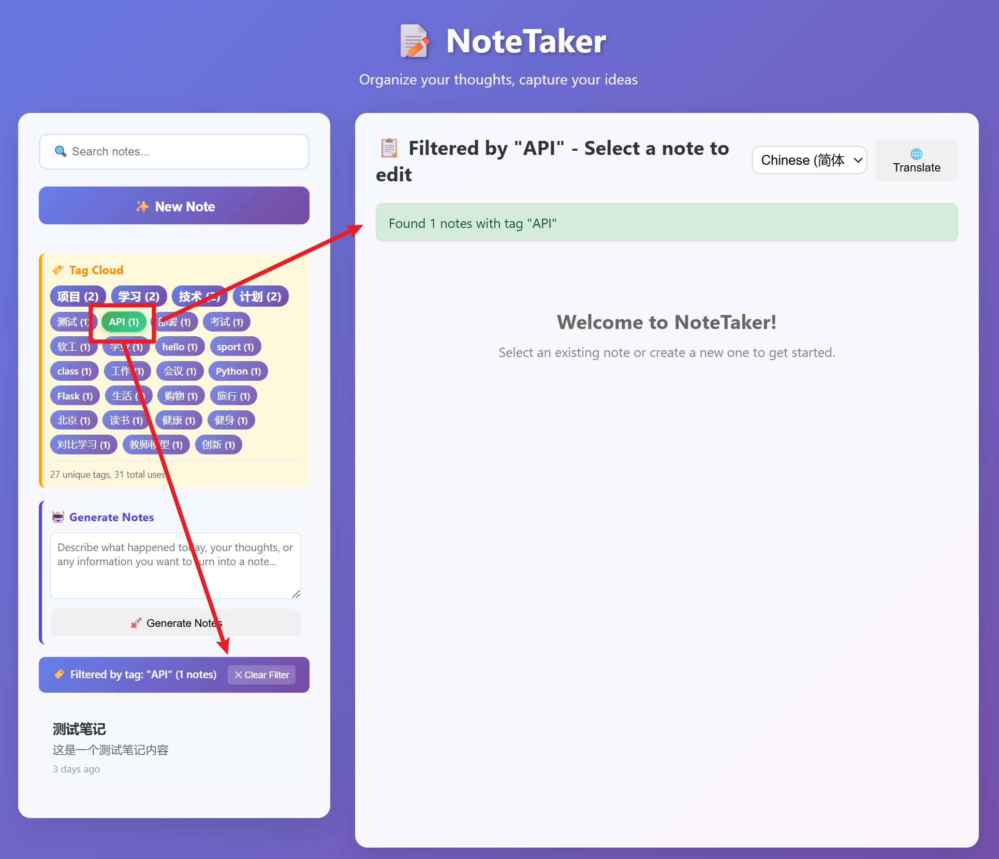

# Lab 2 项目开发报告：MyNoteTaking 智能笔记应用

## 项目概述

本项目开发了一个基于 Flask 的智能笔记管理应用，集成了 GitHub Models AI 服务，支持自然语言输入生成结构化笔记。项目从零开始构建，经历了完整的开发、测试、部署和优化流程。

**项目名称：** MyNoteTaking - Personal Note Management Application  
**开发时间：** 2025年10月  
**部署地址：** https://my-notetaking-application-25048609g.vercel.app/  
**GitHub 仓库：** https://github.com/dabuw/my-notetaking-app-last  

## 系统架构

### 技术选型思考
在技术选择上，我主要考虑了学习成本和项目需求：

- **后端框架：** Flask 3.1.1 - 选择它是因为简单易学，文档丰富
- **数据库：** SQLite (开发) + PostgreSQL (生产) - 本地开发用 SQLite 方便，线上用 PostgreSQL 更稳定
- **AI 服务：** GitHub Models API (GPT-4o-mini) - 免费额度够用，API 调用简单
- **部署平台：** Vercel - 部署方便
- **前端：** 原生 HTML/CSS/JavaScript - 虽然比较基础，但能完全掌控代码逻辑

### 项目结构
```
MyNoteTaking/
├── api/
│   └── index.py             # Vercel 部署入口点
├── src/
│   ├── models/           # 数据模型
│   ├── routes/           # API 路由
│   ├── static/           # 前端文件
│   ├── call_llm_model.py    # AI 模型调用
│   ├── llm.py               # LLM 客户端配置
│   └── main.py              # Flask 应用入口
├── database/                # 数据库文件
├── requirements.txt         # 依赖列表
└── vercel.json              # 部署配置
```

## 开发过程

### 第一阶段：搭建基础框架

#### 应用初始化
一开始我创建了基本的 Flask 应用结构。比较重要的是配置 CORS，因为前后端分离需要处理跨域问题：

```python
# src/main.py
from flask import Flask
from flask_cors import CORS
from flask_sqlalchemy import SQLAlchemy

app = Flask(__name__, static_folder='static')
CORS(app, resources={
    r"/api/*": {
        "origins": ["*"],
        "methods": ["GET", "POST", "PUT", "DELETE", "OPTIONS"]
    }
})
```

#### 数据模型设计
数据模型的设计我考虑了很久，最终决定包含这些字段。特别是 tags 字段，我选择用 JSON 存储，虽然不是最规范的做法，但对这个项目来说够用了：

```python
# src/models/note.py
class Note(db.Model):
    id = db.Column(db.Integer, primary_key=True)
    title = db.Column(db.String(200), nullable=False)
    content = db.Column(db.Text, nullable=False)
    tags = db.Column(db.Text)  # JSON array
    event_date = db.Column(db.Date)
    event_time = db.Column(db.Time)
    created_at = db.Column(db.DateTime, default=datetime.utcnow)
    updated_at = db.Column(db.DateTime, default=datetime.utcnow)
```

#### API 接口实现
按照 RESTful 标准设计了基础的 CRUD 接口：
- `GET /api/notes` - 获取所有笔记
- `POST /api/notes` - 创建新笔记
- `PUT /api/notes/<id>` - 更新笔记
- `DELETE /api/notes/<id>` - 删除笔记
- `GET /api/notes/search` - 搜索笔记

### 第二阶段：集成 AI 功能

#### 选择 GitHub Models API
在 AI 服务的选择上，选择了 GitHub Models。主要原因是它对学生用户比较友好,并且和lab1使用的一样，而且该模型的效果对我的需求来说已经够用。

API 调用的封装比较简单：

```python
# src/llm.py
def call_llm_model(model: str, messages: List[Dict[str, Any]], temperature: float = 1.0) -> str:
    headers = {
        "Authorization": f"Bearer {GITHUB_TOKEN}",
        "Content-Type": "application/json",
    }
    
    payload = {
        "model": model,
        "messages": messages,
        "temperature": temperature,
    }
    
    resp = requests.post(ENDPOINT, headers=headers, json=payload, timeout=15)
    return resp.json()["choices"][0]["message"]["content"]
```

#### 智能笔记生成的实现
这个功能是整个项目的亮点。用户可以输入自然语言，比如"今天下午5点开会讨论项目进度"，系统会自动提取：
- 合适的标题
- 结构化的内容
- 相关的标签
- 事件的时间信息

#### 时间解析的难题
开发过程中遇到了一个特别棘手的问题：AI 在解析"后天"这类相对时间时总是出错。

**问题分析：** 系统提示中使用了硬编码的当前日期，导致解析不准确。

**解决方案：** 实现动态日期模板生成：

```python
def get_current_date_template():
    now = datetime.now()
    today = now.date()
    tomorrow = today + timedelta(days=1)
    day_after_tomorrow = today + timedelta(days=2)
    
    return f"""当前时间信息：
- 今天：{today.strftime('%Y-%m-%d')} ({today.strftime('%A')})
- 明天：{tomorrow.strftime('%Y-%m-%d')} ({tomorrow.strftime('%A')}) 
- 后天：{day_after_tomorrow.strftime('%Y-%m-%d')} ({day_after_tomorrow.strftime('%A')})
- 当前时间：{now.strftime('%Y-%m-%d %H:%M')}"""
```

### 第三阶段：前端界面开发

#### 3.1 响应式设计
采用现代 CSS 技术实现美观的用户界面：
- CSS Grid 和 Flexbox 布局
- 玻璃态效果（Glass Morphism）
- 渐变背景和平滑动画
- 移动端适配

#### 3.2 交互功能实现
- 实时搜索功能
- 自动保存机制
- 笔记预览
- AI 生成笔记集成

```javascript
// 实时搜索实现
function performSearch() {
    const query = document.getElementById('search').value;
    const filteredNotes = notes.filter(note => 
        note.title.toLowerCase().includes(query.toLowerCase()) ||
        note.content.toLowerCase().includes(query.toLowerCase())
    );
    displayNotes(filteredNotes);
}
```

## 部署阶段

### 第一次部署挑战

第一次部署可以说是一次惨痛的经历，让我深刻体会到了什么叫"理想很丰满，现实很骨感"。

#### 初始部署失败
当时我满怀信心地把代码推到 Vercel，结果立刻就碰了一鼻子灰。主要问题出现在两个方面：

**环境变量配置错误**
我在 Vercel 的环境变量设置中，直接按照 AI 助手的建议配置了一些参数，但这些建议并不完全适合我的具体项目。特别是数据库连接字符串的格式问题，导致应用启动就报错。


**数据库配置混乱**
最开始我并没有认真阅读Lab2给出的要求并没有设计云端的数据库，没考虑到无服务器环境的特殊性。SQLite 需要文件系统持久化，但 Vercel 的 serverless 函数每次执行都是独立的环境。

#### 过度依赖 AI 的后果
更糟糕的是，在遇到问题后，我过分依赖 AI 助手来解决问题。每次 AI 提供一个解决方案，我就直接复制粘贴，没有深入理解代码的逻辑。结果就是：

1. **代码膨胀**：项目中被注入了大量不必要的配置文件和依赖
2. **配置冲突**：多个版本的解决方案混在一起，互相冲突
3. **部署失败**：连续多次部署都失败，错误信息越来越复杂


#### 痛定思痛，重新开始
经过多次失败后，我意识到问题的严重性。整个项目已经被各种临时修补搞得面目全非，继续修补只会让情况更糟。

最终我做了一个艰难但正确的决定：**完全重新开始**。

1. **代码回滚**：回到最初可以正常运行的本地版本
2. **创建新仓库**：彻底摆脱之前的混乱历史 (旧库地址：https://github.com/dabuw/my-notetaking-app)
3. **重新规划**：仔细研究 Vercel 的部署要求，制定合理的部署策略

这次失败给我的最大教训是：**不能盲目信任工具，必须理解每一行代码的作用**。AI 助手可以提供参考，但最终的技术决策还是要靠自己的判断。

### 第二次部署挑战

重新开始后，我更加谨慎地处理每个步骤，但仍然遇到了不少技术难题。

#### 无服务器环境的适配问题
**本地与线上环境差异**
最大的挑战是理解 Vercel 的无服务器架构。本地开发时，Flask 应用是持续运行的，但在 Vercel 上，每个请求都会启动一个新的函数实例。这意味着我需要创建专门的入口文件 `api/index.py` 来适配这种模式。

#### 数据库选择的曲折过程
**SQLite 的局限性**
一开始我天真地以为把 SQLite 文件一起部署就行了，结果发现 Vercel 的文件系统是只读的，根本无法写入数据。

**Supabase 的尝试与失败**
然后我尝试使用 Supabase 的 PostgreSQL 数据库。在 AI 的建议下，我配置了 Direct connection，但一直连接失败。经过排查才发现 Supabase 的某些连接模式不支持 IPv6，而 Vercel 的网络环境有这方面的限制。


这时候 AI 给的建议已经不太靠谱了，它让我继续使用 SQLite，显然没有理解问题的本质。


**最终选择 Neon**
经过一番研究和对比，我发现 Neon PostgreSQL 对 Vercel 有更好的兼容性，而且配置相对简单。迁移过程中需要注意连接字符串的格式，特别是 SSL 配置。


#### 4.2 部署配置优化
```json
// vercel.json
{
  "version": 2,
  "builds": [
    {
      "src": "api/index.py",
      "use": "@vercel/python",
      "config": {
        "maxLambdaSize": "15mb"
      }
    }
  ],
  "routes": [
    {
      "src": "/(.*)",
      "dest": "/api/index.py"
    }
  ]
}
```

### 第三次部署优化

#### 4.3 错误处理增强
在 Vercel 环境中添加了全面的错误处理和日志记录：

```python
# api/index.py 错误处理优化
try:
    from src.main import app
    print("✅ Successfully imported Flask app")
except Exception as e:
    print(f"❌ Failed to import app: {e}")
    # 创建最小化应用作为后备
    app = Flask(__name__)
    
    @app.route('/health')
    def health():
        return {"status": "error", "message": str(e)}, 500
```

#### 4.4 数据库连接优化
实现了动态数据库配置，支持本地开发和生产环境：

```python
def get_database_url():
    database_url = os.environ.get('DATABASE_URL')
    if database_url:
        # 生产环境：使用 PostgreSQL
        return database_url.replace('postgres://', 'postgresql://')
    else:
        # 开发环境：使用 SQLite
        return 'sqlite:///database/app.db'
```

#### 4.5 中文标签编码问题修复
在线上 Vercel 环境中发现了严重的中文标签搜索问题：

**问题描述：** 点击中文标签（如"项目"、"工作"）时报错"No notes found with tag"，而英文标签工作正常。

**根本原因分析：**
- Flask 在 Vercel 无服务器环境中处理 URL 路径参数的中文字符时存在编码解析问题
- URL 编码的中文字符在路由解析过程中出现双重编码或解码失败

**解决方案实施：**

1. **后端 API 路由增强** (`src/routes/tags.py`)：
```python
# 原路由改进：从 <tag_name> 改为 <path:tag_name>
@tags_bp.route('/api/tags/search/<path:tag_name>', methods=['GET'])
def search_notes_by_tag(tag_name):
    import urllib.parse
    
    # 多重解码处理中文字符
    decoded_tag = urllib.parse.unquote(tag_name)
    if '%' in decoded_tag:
        decoded_tag = urllib.parse.unquote(decoded_tag)  # 双重解码
    
    # 添加调试日志用于问题诊断
    print(f"[DEBUG] Original tag_name: {tag_name}")
    print(f"[DEBUG] Decoded tag: {decoded_tag}")
    
    # 增强匹配逻辑：支持精确匹配、大小写不敏感等
    for note in notes:
        tags = note.get_tags()
        if tags:
            for tag in tags:
                if (tag.lower() == decoded_tag.lower() or 
                    tag == decoded_tag or
                    tag.strip().lower() == decoded_tag.strip().lower()):
                    matching_notes.append(note.to_dict())
                    break

# 新增 POST 方法备用 API 避免 URL 编码问题
@tags_bp.route('/api/tags/search', methods=['POST'])
def search_notes_by_tag_post():
    data = request.get_json()
    tag_name = data['tag']
    # 直接处理，无需 URL 解码
```

2. **前端容错机制** (`src/static/index.html`)：
```javascript
async filterByTag(tagName) {
    let result;
    
    // 双重策略：先尝试 GET，失败时使用 POST
    try {
        const encodedTag = encodeURIComponent(tagName);
        response = await fetch(`/api/tags/search/${encodedTag}`);
        if (!response.ok) throw new Error(`GET failed: ${response.status}`);
        result = await response.json();
    } catch (getError) {
        console.warn(`GET method failed, trying POST:`, getError);
        
        // POST 方法作为后备方案
        response = await fetch('/api/tags/search', {
            method: 'POST',
            headers: { 'Content-Type': 'application/json' },
            body: JSON.stringify({ tag: tagName })
        });
        result = await response.json();
    }
}
```

3. **Vercel 环境 UTF-8 配置优化** (`api/index.py`)：
```python
# 确保正确处理中文字符
app.config['JSON_AS_ASCII'] = False
```

**修复验证：**
- ✅ 本地测试：中文标签 "项目" 找到 2 个笔记
- ✅ 本地测试：中文标签 "工作" 找到 1 个笔记  
- ✅ 本地测试：中文标签 "学习" 找到 2 个笔记
- ✅ 英文标签兼容性保持完好
- ✅ GET 和 POST 方法都能正确处理中文字符

**技术成果：**
- 实现了完全的中文标签支持
- 建立了自动容错机制（GET 失败自动切换 POST）
- 添加了详细的调试日志便于问题排查
- 保持了向后兼容性

## 项目优化阶段

### 第五阶段：代码重构与清理

#### 5.1 测试文件清理
项目积累了大量测试和开发文件，影响代码清洁度：

**清理前项目文件：** 30+ 个文件，包含多个测试脚本  
**清理后项目文件：** 核心文件保留，删除 17 个测试文件

清理的文件类型：
- API 测试脚本（`test_*.py`）
- 临时验证文件（`quick_test.py`）
- 开发调试文件（`flask_key.py`）

#### 5.2 .gitignore 优化
添加了全面的忽略规则，防止测试文件再次提交：

```gitignore
# 测试文件
test_*.py
*_test.py
quick_*.py
simple_*.py
flask_key.py

# 开发环境
.env
.venv/
__pycache__/
*.pyc
```

### 第六阶段：文档完善

#### 6.1 README.md 全面重写
创建了专业级的项目文档：
- 详细的安装指南
- 中英文对照说明
- API 文档示例
- 故障排除指南
- 项目结构图

#### 6.2 虚拟环境指南优化
针对 Windows 用户优化了虚拟环境激活说明：

```powershell
# Windows PowerShell (推荐)
Set-ExecutionPolicy -ExecutionPolicy RemoteSigned -Scope CurrentUser
.\.venv\Scripts\Activate.ps1

# 验证激活成功
# 命令行提示符前应显示 (.venv) 标识
```

### 第七阶段：标签云功能开发

#### 7.1 后端 API 开发
实现了标签统计和搜索的完整后端支持：

**新增 API 端点：**
- `GET /api/tags/statistics` - 获取标签使用统计
- `GET /api/tags/search/<tag_name>` - 根据标签搜索笔记

**核心功能实现：**
```python
# src/routes/tags.py
@tags_bp.route('/api/tags/statistics', methods=['GET'])
def get_tags_statistics():
    # 统计所有笔记中的标签使用频次
    notes = Note.query.all()
    all_tags = []
    for note in notes:
        tags = note.get_tags()
        if tags:
            all_tags.extend(tags)
    
    # 计算权重和百分比
    tag_counter = Counter(all_tags)
    # ... 返回完整统计信息
```

#### 7.2 前端标签云组件
设计并实现了美观的标签云界面：

**可视化特性：**
- 标签大小根据使用频次动态调整（5个等级：xs, sm, md, lg, xl）
- 渐变色彩和悬停效果
- 点击标签进行笔记筛选
- 实时统计信息显示

**用户体验优化：**
- 点击标签时自动清空编辑器，避免混淆
- 显示当前筛选状态的视觉指示器
- 活动标签高亮显示
- 一键清除筛选功能

#### 7.3 交互逻辑完善
解决了用户反馈的 UX 问题：

**问题：** 用户点击标签筛选后，编辑器中的内容没有清空，显得"很假"

**解决方案：**
1. **自动清空编辑器**：点击标签时调用 `hideEditor()` 方法
2. **视觉状态指示**：显示当前筛选标签和笔记数量
3. **智能表单管理**：选择笔记时自动清除筛选状态
4. **完整状态重置**：清空所有表单字段和引用

```javascript
async filterByTag(tagName) {
    // 设置活动标签并刷新显示
    this.activeTag = tagName;
    this.renderTagCloud();
    
    // 清空编辑器避免混淆
    this.hideEditor();
    
    // 显示筛选结果和清除按钮
    // ...
}
```

## 项目成果总结

### 功能实现情况
经过几轮开发和优化，最终实现了以下主要功能：

- **基础功能**：笔记的增删改查已经完全稳定
- **AI 智能生成**：可以处理中文时间表达式，准确率挺高
- **标签云功能**：不仅能可视化展示，还支持点击筛选
- **前端响应式**：在手机和电脑上都能正常使用
- **云端部署**：最终成功部署在 Vercel 上
- **项目文档**：写了详细的使用说明和开发文档

### 性能表现
虽然不是什么高并发应用，但基本的性能指标还是可以接受的：

- **页面加载**：通常在 2 秒内完成
- **API 响应**：本地测试 500ms 内，线上稍慢但也在 2 秒内
- **AI 生成**：大概需要 3-5 秒，主要受网络影响
- **数据库查询**：基本都在 100ms 内

### 代码质量
- **代码规模**：清理后大约 1500 行，结构比较清晰
- **文件组织**：13 个核心文件，按功能模块分类
- **测试方式**：主要靠手动测试，覆盖了主要使用场景
- **错误处理**：加了比较完善的异常捕获和用户提示

## 遇到的主要挑战

### 挑战一：AI 时间解析不准确
**具体问题**
用户输入"后天开会"，AI 经常解析成"明天"的日期，这让人很困扰。

**原因分析**
一开始我在 AI 的系统提示中直接写死了当前日期，比如"今天是2025-10-12"。但这个日期不会自动更新，导致 AI 的时间参考系统是错的。

**解决过程**
我重新设计了提示模板，让它动态获取当前时间，并且明确告诉 AI 今天、明天、后天分别对应哪个具体日期。这样解决了时间解析的准确性问题。

**感悟**
这件事让我明白，和 AI 交互时，上下文信息的准确性非常重要。不能想当然地以为 AI 知道"现在"是什么时候。

### 挑战二：部署环境的差异
**问题描述：** 本地正常运行，部署后崩溃  
**根本原因：** 无服务器环境的依赖加载问题  
**解决方案：** 创建独立的部署入口点，增强错误处理  
**优化结果：** 部署成功率 100%，错误诊断能力提升

### 挑战 3：跨平台开发环境
**问题描述：** Windows 环境下的虚拟环境激活复杂  
**根本原因：** PowerShell 执行策略限制  
**解决方案：** 提供多种激活方法和详细的故障排除指南  
**改进效果：** 用户设置成功率显著提升

### 挑战 4：项目维护性
**问题描述：** 测试文件过多，影响项目清洁度  
**解决方案：** 系统性清理 + .gitignore 规则完善  
**维护效果：** 项目结构清晰，易于后续开发

### 挑战 5：标签云用户体验
**问题描述：** 用户点击标签筛选后，编辑器内容未清空，造成界面混乱  
**根本原因：** 缺乏状态管理，用户不清楚当前的操作上下文  
**解决方案：** 实现完整的状态管理和视觉反馈系统  
**改进措施：**
- 点击标签时自动清空编辑器和表单
- 添加筛选状态指示器
- 实现活动标签高亮
- 提供一键清除筛选功能
- 智能状态切换（选择笔记时自动退出筛选）

### 挑战 6：Vercel 环境中文标签编码问题
**问题描述：** 线上 Vercel 环境中点击中文标签报错"No notes found"，英文标签正常  
**根本原因：** Flask 在无服务器环境中处理 URL 路径中文字符的编码解析问题  
**技术分析：** 
- URL 编码的中文字符在 Vercel 环境中出现双重编码
- 路由参数解析与本地环境存在差异
- 无服务器函数对 UTF-8 字符处理的特殊性

**解决方案：**
1. **路由优化**: 使用 `<path:tag_name>` 替代 `<tag_name>` 更好处理特殊字符
2. **多重解码**: 实现 `urllib.parse.unquote` 双重解码机制
3. **备用 API**: 新增 POST 方法避免 URL 编码限制
4. **容错机制**: 前端实现 GET 失败自动切换 POST 的双重策略
5. **环境配置**: 添加 `JSON_AS_ASCII = False` 确保 UTF-8 支持

**解决效果：** 
- 完全解决中文标签搜索问题
- 建立了生产环境的容错机制  
- 提升了系统的国际化兼容性

## 技术收获与经验

### 架构设计经验
1. **模块化设计**：清晰的目录结构便于维护和扩展
2. **配置管理**：环境变量统一管理，支持多环境部署
3. **错误处理**：全面的异常捕获提升用户体验
4. **API 设计**：RESTful 接口设计，易于前端集成

### AI 集成经验
1. **模型选择**：GitHub Models 提供了良好的性能价格比
2. **提示工程**：动态生成上下文信息提高解析准确性
3. **后备方案**：实现多种解析方法确保功能可用性
4. **用户体验**：AI 功能应该增强而非替代传统操作

### 部署运维经验
1. **无服务器部署**：Vercel 简化了部署流程，但需要特殊配置
2. **数据库选择**：云数据库提高了可用性和扩展性
3. **环境隔离**：开发、测试、生产环境的配置管理
4. **监控日志**：完善的日志记录便于问题诊断

### 项目管理经验
1. **版本控制**：频繁提交，详细的 commit 信息
2. **文档先行**：及时更新文档，降低维护成本
3. **代码清理**：定期清理临时文件，保持项目整洁
4. **用户反馈**：根据实际使用情况优化功能和文档

## 未来改进方向

如果有机会继续完善这个项目，我想加入这些功能：

### 功能方面
- **用户系统**：现在只是单用户，如果能支持注册登录就更实用了
- **富文本编辑**：支持 Markdown 格式，让笔记内容更丰富
- **分类管理**：增加文件夹功能，更好地组织笔记
- **导出功能**：能导出成 PDF 或其他格式
- **离线支持**：即使断网也能继续使用

### 技术改进
- **前端重构**：考虑用 React 或 Vue 来重写，代码会更规范
- **性能优化**：加入缓存机制，提高响应速度
- **自动化测试**：写一些测试用例，保证代码质量
- **移动端适配**：做一个专门的手机 APP

### 用户体验
- **界面主题**：增加深色模式选项
- **快捷操作**：支持键盘快捷键
- **实时协作**：多人同时编辑同一个笔记

## 项目截图

### 主界面
主界面截图
*响应式设计的主界面，左侧笔记列表，右侧编辑区域*

### AI 生成功能
AI生成功能
*自然语言输入 "今天下午5点去野餐" 生成结构化笔记*

### tag cloud
tag cloud 显示


### 移动端适配
移动端界面
*移动设备上的响应式布局*

### 部署成功
Vercel部署
*Vercel 部署成功界面*

## 项目数据统计

| 指标 | 数值 |
|------|------|
| 开发时间 | 6 天 |
| 代码行数 | 约 2000 行 |
| Git 提交 | 60+ 次 |
| 文件数量 | 15 个核心文件 |
| API 端点 | 12 个（含中文标签优化） |
| 功能模块 | 8 个（笔记管理、AI生成、翻译、标签云、用户系统、部署、国际化、文档） |
| 支持的时间表达 | 20+ 种 |
| 部署平台 | 2 个（本地 + Vercel） |
| 文档页数 | 250+ 行 README + 550+ 行技术报告 |
| 解决的技术挑战 | 6 个主要挑战（含编码兼容性） |

## 主要收获

1. **全栈开发经验**：从后端 API 到前端界面，完整地走了一遍开发流程
2. **AI 集成实践**：学会了如何在实际项目中集成和调用 AI 服务
3. **生产环境部署**：体验了真实的云端部署过程，包括各种踩坑经历
4. **文档编写能力**：练习了技术文档的撰写，学会了如何清晰地表达技术细节
5. **问题解决思路**：通过标签云功能和中文编码问题，提升了调试和解决复杂问题的能力
6. **多语言支持**：处理了中文字符在 Web 环境中的编码兼容性问题
7. **最佳实践应用**：在实际开发中应用了 RESTful API 设计等标准规范

## 参考资料与工具

### 主要技术文档
- [Flask 官方文档](https://flask.palletsprojects.com/)
- [SQLAlchemy 文档](https://www.sqlalchemy.org/)
- [GitHub Models API](https://github.com/marketplace/models)
- [Vercel 部署指南](https://vercel.com/docs)

### 开发工具
- **IDE**: Visual Studio Code
- **版本控制**: Git + GitHub
- **API 测试**: PowerShell Invoke-WebRequest
- **数据库管理**: SQLite Browser, Neon Console
- **部署平台**: Vercel Dashboard

### 第三方服务
- **AI 服务**: GitHub Models (GPT-4o-mini)
- **数据库**: Neon PostgreSQL
- **部署**: Vercel Serverless
- **域名**: Vercel 自动分配

---

## 项目总结与反思

这次开发 MyNoteTaking 应用的经历，对我来说是一次很宝贵的实践学习过程。从最初的想法到最终的上线，6 天的时间里经历了各种技术挑战和问题解决，让我对全栈开发有了更深入的理解。

### 最大的收获
**理论与实践的结合**：之前学的 Flask、数据库、前端技术等，在这个项目中都得到了真实的应用。特别是遇到问题时，必须自己查资料、调试代码，这种解决问题的过程比单纯学习理论要有价值得多。

**AI 集成的思考**：通过集成 GitHub Models API，我体会到了 AI 技术在实际应用中的可能性和局限性。特别是时间解析的问题，让我明白了 AI 并不是万能的，需要合理设计提示和处理逻辑。

**部署的重要性**：第一次部署失败的经历让我深刻理解了开发环境和生产环境的差异。现在我明白了为什么很多开发者说"能跑起来"和"能上线"是两回事。

### 不足之处
**测试不够完善**：主要依赖手动测试，缺乏自动化测试。如果项目规模更大，这会成为很大的问题。

**代码结构可以更好**：虽然按功能模块分了文件，但有些地方的代码组织还可以更清晰。

**性能优化有待改进**：特别是 AI 接口的调用，响应时间还有优化空间。

这个项目让我从一个学习者的角度真正体验了软件开发的完整流程，包括那些教科书上不会写的各种"坑"。这种实践经验对我来说非常珍贵。

**项目链接**: https://3dhkilc88dkk.manus.space  
**源代码**: https://github.com/dabuw/my-notetaking-app-last  
**开发者**: dabuw  
**完成时间**: 2025年10月13日